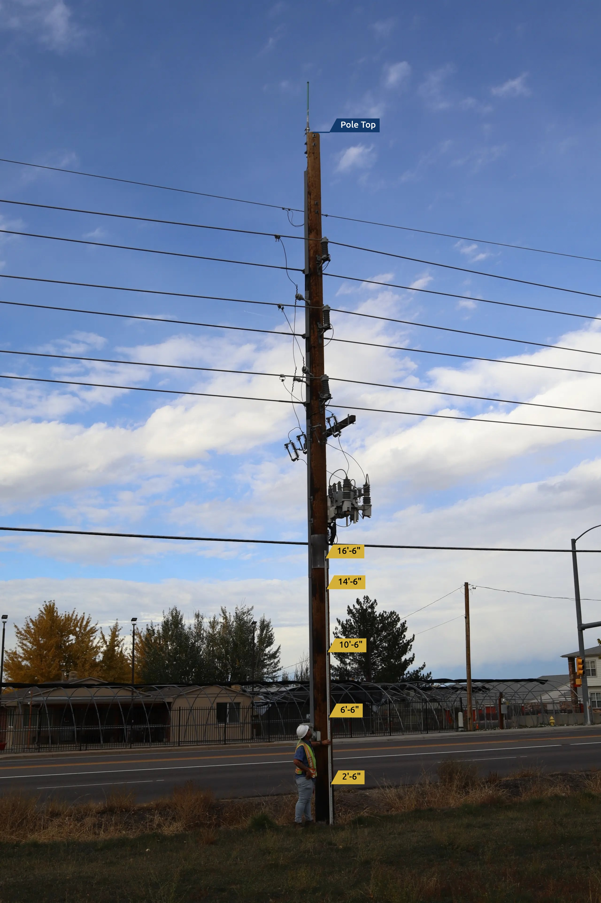
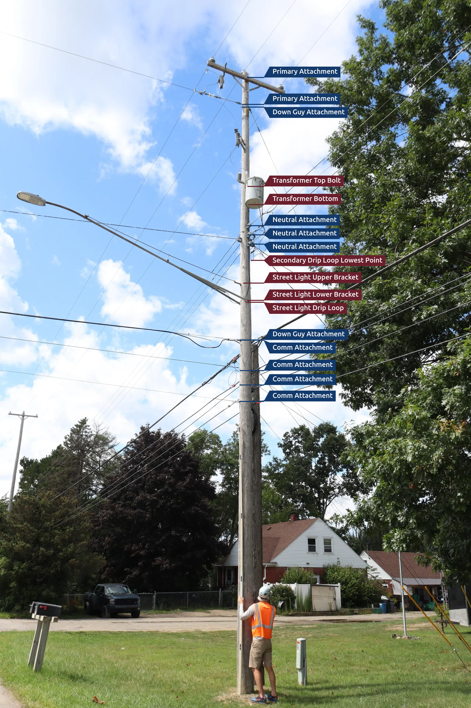
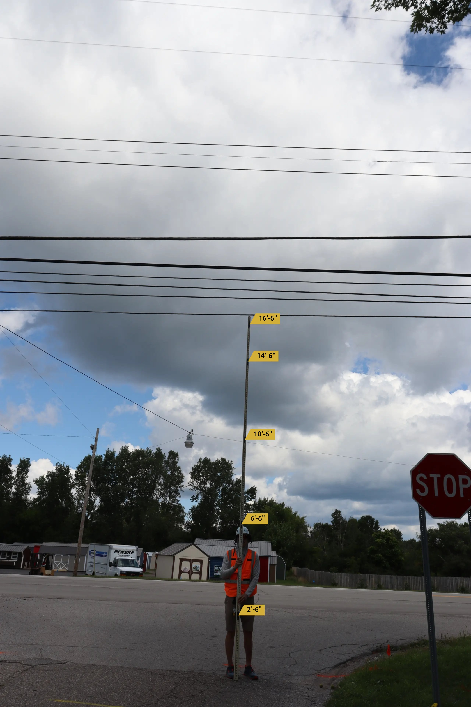
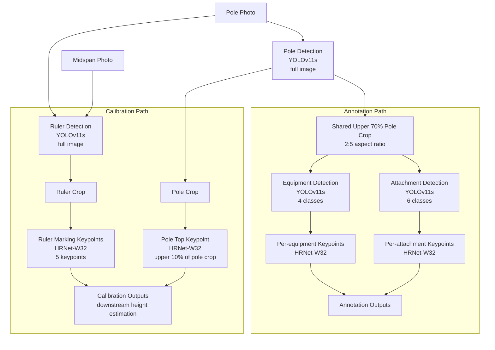
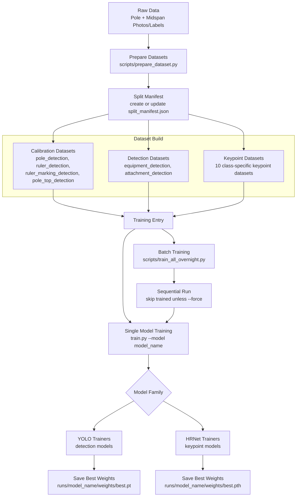

# Pole Calibration & Annotation Pipeline

A multi-stage computer vision system for automated calibration and annotation of electric utility pole infrastructure from field photographs. The pipeline combines YOLOv11 region detection with HRNet-W32 keypoint localization across 16 specialized models to estimate pole height, localize equipment reference points, and detect wire attachment points.

**[Live Demo](https://pole-annotation-app-gyq2qukkaq-uc.a.run.app/)** — External deployment; app source is not included in this repository

**[Website Demo Video](assets/Website_Demo.webm)** — Short walkthrough of the deployed interface

## Demo

<p align="center">
  <a href="assets/Website_Demo.webm">
    
  </a>
</p>
<p align="center">
  <em>Preview of the deployed interface. Click the GIF to open the full-quality WebM video.</em>
</p>

## Sample Results

<p align="center">
  
  
  
</p>
<p align="center">
  <em>Left: Calibration pipeline with ruler-marking keypoints (2.5-16.5 ft) and pole-top localization. Center: Annotation pipeline with equipment and wire-attachment localization. Right: Midspan calibration.</em>
</p>

## Inference Pipeline

Runtime inference flow on pole/midspan photos.



## Training Pipeline

Model development flow from data preparation to saved checkpoints.



### Key Design Decisions

- **Hierarchical crop strategy**: Upper 70% of pole in 2:5 aspect ratio — balances field-of-view with resolution for equipment/attachment detection
- **Per-class threshold optimization**: F1-maximizing confidence thresholds via automated sweep (not a single global threshold)
- **Task-specific augmentation**: Minimal augmentation for scale-sensitive calibration models; aggressive augmentation (mosaic, mixup, copy-paste) for sparse equipment classes
- **Keypoint interpolation**: Linear regression on confident ruler markings with index-based fallback for low-confidence or occluded points

## Results

The metrics below are reported results from prior training/evaluation runs. The
repository currently does **not** include datasets, trained weights, or saved
evaluation outputs, so these numbers are documentation rather than artifacts
that can be verified from the checked-in files alone.

### Calibration Pipeline

| Component | Metric | Value |
|-----------|--------|-------|
| Pole Detection | mAP@0.5 | 0.908 |
| Pole Detection | Detection Rate | 99.2% |
| Ruler Detection | mAP@0.5 | 0.908 |
| Ruler Detection | Detection Rate | 99.8% |
| Ruler Markings (5 keypoints) | Mean Error | **0.335 inches** |
| Ruler Markings | PCK@1 inch | 98.4% |
| Pole Top | Mean Error | **1.49 inches** |
| Pole Top | PCK@3 inches | 95.0% |

### Equipment Detection

| Class | F1 Score | Confidence Threshold |
|-------|----------|---------------------|
| Transformer | 0.965 | 0.361 |
| Street Light | 0.950 | 0.101 |
| Riser | 0.757 | 0.288 |
| Secondary Drip Loop | 0.718 | 0.300 |
| **Overall mAP@0.5** | **0.865** | |

### Attachment Detection

| Class | F1 Score | Confidence Threshold |
|-------|----------|---------------------|
| Comm | 0.882 | 0.213 |
| Neutral | 0.834 | 0.281 |
| Primary | 0.778 | 0.192 |
| Secondary | 0.642 | 0.131 |
| Down Guy | 0.628 | 0.141 |
| Guy | 0.493 | 0.211 |
| **Overall mAP@0.5** | **0.744** | |

> **Note**: Wire classes (guy, down guy) remain challenging due to thin visual profiles, high occlusion, and limited training data. Cable classes (comm, primary, neutral) perform significantly better.

## Models

| Model | Architecture | Task |
|-------|-------------|------|
| `pole_detection` | YOLOv11s | Bounding box detection of utility poles |
| `ruler_detection` | YOLOv11s | Bounding box detection of ruler scale bars |
| `ruler_marking_detection` | HRNet-W32 | 5 keypoints on ruler markings (2.5, 6.5, 10.5, 14.5, 16.5 ft) |
| `pole_top_detection` | HRNet-W32 | Single keypoint at pole top |
| `equipment_detection` | YOLOv11s | 4-class detection (riser, transformer, street light, secondary drip loop) |
| `riser_keypoint_detection` | HRNet-W32 | 1 keypoint (top) |
| `transformer_keypoint_detection` | HRNet-W32 | 2 keypoints (top bolt, bottom) |
| `street_light_keypoint_detection` | HRNet-W32 | 3 keypoints (upper bracket, lower bracket, drip loop) |
| `secondary_drip_loop_keypoint_detection` | HRNet-W32 | 1 keypoint (lowest point) |
| `attachment_detection` | YOLOv11s | 6-class detection (comm, down guy, primary, secondary, neutral, guy) |
| `comm_keypoint_detection` | HRNet-W32 | 1 keypoint (center) |
| `down_guy_keypoint_detection` | HRNet-W32 | 1 keypoint (center) |
| `primary_keypoint_detection` | HRNet-W32 | 1 keypoint (center) |
| `secondary_keypoint_detection` | HRNet-W32 | 1 keypoint (center) |
| `neutral_keypoint_detection` | HRNet-W32 | 1 keypoint (center) |
| `guy_keypoint_detection` | HRNet-W32 | 1 keypoint (center) |

## Project Structure

```
├── src/
│   ├── config.py                 # Single source of truth: paths, models, thresholds
│   ├── models.py                 # HRNet-W32 keypoint architecture
│   ├── training_utils.py         # Training loops for YOLO and keypoint models
│   ├── inference.py              # High-level inference API
│   ├── inference_utils.py        # Low-level detection and keypoint inference
│   ├── inference_pipelines.py    # Pre-configured pipelines (calibration, equipment, attachment, annotation)
│   ├── datasets.py               # PyTorch dataset classes with augmentation
│   ├── evaluation_utils.py       # mAP, PCK, IoU calculation
│   ├── evaluation_charts.py      # Metric visualization
│   ├── threshold_utils.py        # F1-maximizing threshold sweep
│   ├── visualization.py          # Bounding box and keypoint drawing
│   ├── losses.py                 # Focal heatmap loss
│   └── ...
├── scripts/
│   ├── prepare_dataset.py        # Prepare calibration, detection, and keypoint datasets
│   ├── evaluate_models.py        # Run calibration, detection-only, and E2E evaluation
│   ├── threshold_sweep.py        # F1-maximize per-class thresholds
│   ├── train_all_overnight.py    # Automated multi-model training
│   └── ...
├── notebooks/
│   ├── calibration/              # Data exploration, training, evaluation, inference
│   ├── equipment/                # Same structure
│   ├── attachment/               # Same structure
│   └── E2E_Production.ipynb      # Full pipeline demo
├── train.py                      # Unified training entry point
└── requirements.txt
```

## Setup

Prerequisites: Python 3.10+ (CUDA-capable GPU recommended for training speed).

```bash
pip install -r requirements.txt
```

`requirements.txt` covers the core runtime stack for training/inference, but
several scripts and notebooks import additional packages that are not currently
pinned there, including:

```bash
pip install matplotlib pandas scikit-learn tqdm pyyaml
```

Download pretrained HRNet weights:
```bash
python scripts/download_hrnet_pretrained.py
```

## Quick Start

```bash
# 1. Install dependencies
pip install -r requirements.txt
pip install matplotlib pandas scikit-learn tqdm pyyaml

# 2. Download HRNet backbone weights
python scripts/download_hrnet_pretrained.py

# 3. Prepare datasets from local data/
python scripts/prepare_dataset.py

# 4. Train or evaluate
python train.py --model pole_detection
python scripts/evaluate_models.py --calibration
```

## Repository State

This repository contains the pipeline code, notebooks, and helper scripts, but
large artifacts are intentionally not versioned:

- `data/` is a placeholder in git; raw pole/midspan photos and labels are not included
- `models/` is a placeholder in git; pretrained/downloaded weights are not included
- `datasets/`, `runs/`, and `results/` are generated locally and are not present in a fresh clone

Most training, dataset-preparation, and evaluation commands in this README
assume you already have the source data available locally under `data/`.

Dataset preparation uses `datasets/split_manifest.json` as the split source of
truth. By default, `scripts/prepare_dataset.py` preserves existing validation
and test splits and only adds newly discovered samples to train. Use
`--force-manifest` to rebuild splits from scratch, or `--create-manifest-only`
to generate the manifest without writing datasets.

## Training

```bash
# Train any model by name
python train.py --model pole_detection
python train.py --model ruler_marking_detection --epochs 150 --batch-size 64
python train.py --model equipment_detection --warm-start --epochs 50

# Train all models sequentially
python scripts/train_all_overnight.py
```

Prepared datasets are expected under `datasets/<model_name>/` with YOLO format
(for detection) or the repository's custom keypoint format (for HRNet models).
Use `scripts/prepare_dataset.py` to build them from local raw labels once the
source data exists under `data/`.

Weights are saved to `runs/<model_name>/weights/best.pt` (YOLO) or `best.pth` (HRNet).

## Inference

```python
from pathlib import Path
from src.inference import load_all_models, run_end_to_end_inference_simple

models = load_all_models()
results = run_end_to_end_inference_simple(
    Path("path/to/image.jpg"), models, use_tta=True, show_visualization=True
)
```

For production-style annotation on pole photos, the repository also provides a
shared-crop annotation pipeline that runs equipment and attachment detection in
one pole pass:

```python
from pathlib import Path
from src.inference import (
    get_device,
    load_pole_detector,
    load_equipment_detector,
    load_attachment_detector,
    load_keypoint_detector,
    load_attachment_keypoint_detector,
)
from src.inference_pipelines import annotation_pipeline

device = get_device()
pole_detector = load_pole_detector(device)
equip_detector = load_equipment_detector(device)
attach_detector = load_attachment_detector(device)

equip_kp_models = {
    name: load_keypoint_detector(name, device)
    for name in ["riser", "transformer", "street_light", "secondary_drip_loop"]
}
attach_kp_models = {
    name: load_attachment_keypoint_detector(name, device)
    for name in ["comm", "down_guy", "primary", "secondary", "neutral", "guy"]
}

equip_preds, attach_preds, ppi = annotation_pipeline.run_single(
    Path("path/to/pole_photo.jpg"),
    pole_detector,
    equip_detector,
    attach_detector,
    equip_kp_models,
    attach_kp_models,
    device,
)
```

## Evaluation

```bash
# Evaluate calibration pipeline
python scripts/evaluate_models.py --calibration

# Evaluate equipment detection + end-to-end/keypoint metrics
python scripts/evaluate_models.py --equipment

# Evaluate attachment detection + end-to-end/keypoint metrics
python scripts/evaluate_models.py --attachment

# Run everything (calibration + combined equipment/attachment pass)
python scripts/evaluate_models.py --all

# Run threshold sweep to optimize per-class confidence
python scripts/threshold_sweep.py --update-config
```

`scripts/evaluate_models.py` also supports `--plots`, `--plots-only`,
`--results-dir`, and `--device`. When both `--equipment` and `--attachment`
are requested, it uses a combined evaluation path so pole detection is only run
once per image.

## Production Models

Inference defaults to development weights under `runs/<model>/weights/`. If
`USE_PRODUCTION_MODELS=true` is set in the environment, model loading switches
to `models/production/<model>/production/model.pt` or `.pth`.

To promote trained checkpoints into the production registry:

```bash
python scripts/promote_model.py --model pole_detection --version 1.0.0
python scripts/promote_model.py --all
python scripts/promote_model.py --bump
```

## Notebooks

Each pipeline has 4 notebooks for the full ML workflow:

| Notebook | Purpose |
|----------|---------|
| `001_Data_Exploration.ipynb` | Dataset statistics, class distribution, sample visualization |
| `002_Model_Training.ipynb` | Training with hyperparameter exploration |
| `003_Evaluation.ipynb` | Metrics computation, error analysis, threshold tuning |
| `004_Inference.ipynb` | End-to-end inference with visualization |

## Tech Stack

- **Detection**: [Ultralytics YOLOv11](https://github.com/ultralytics/ultralytics) (small variant)
- **Keypoints**: Custom [HRNet-W32](https://arxiv.org/abs/1902.09212) with Gaussian heatmap regression
- **Training**: PyTorch, TensorBoard
- **Evaluation**: Custom mAP, PCK, IoU implementations

## License

MIT License - see [LICENSE](LICENSE) for details.
