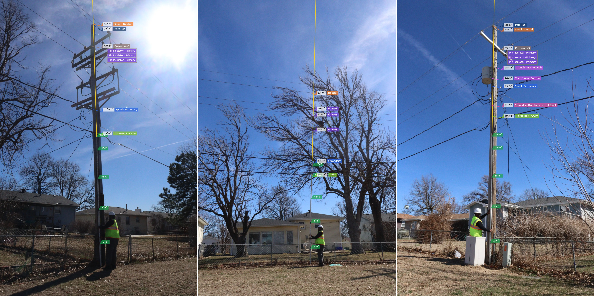
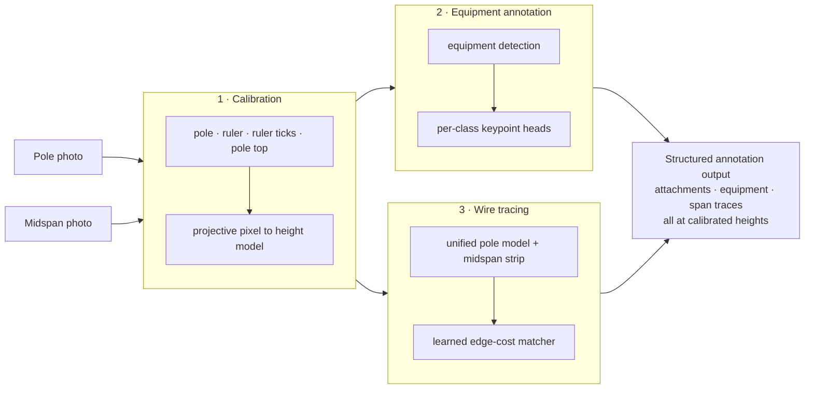
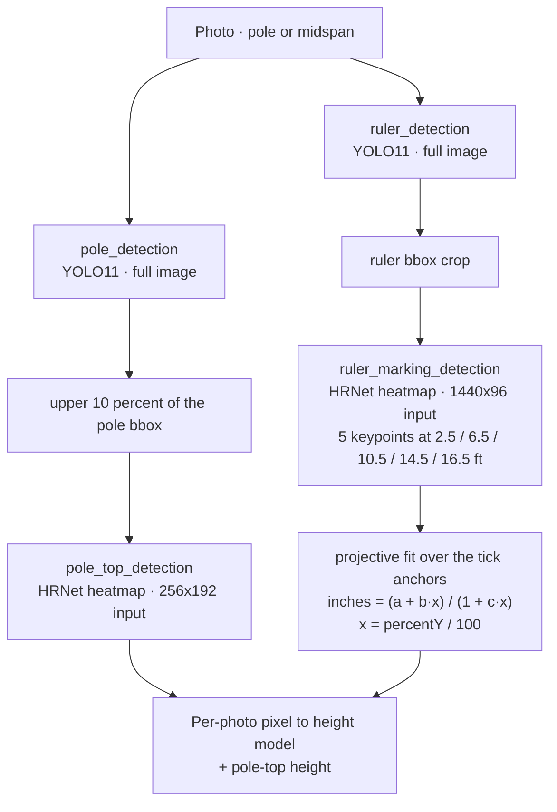
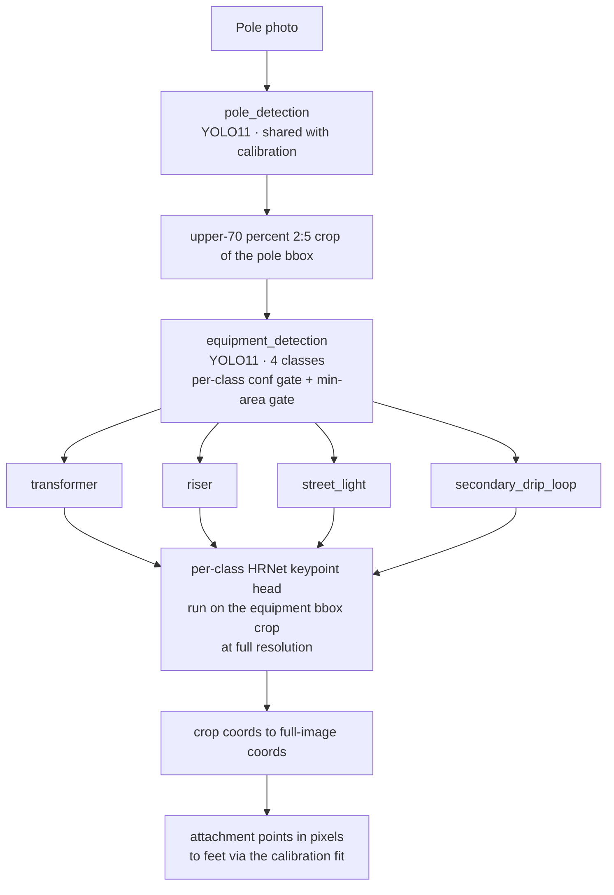
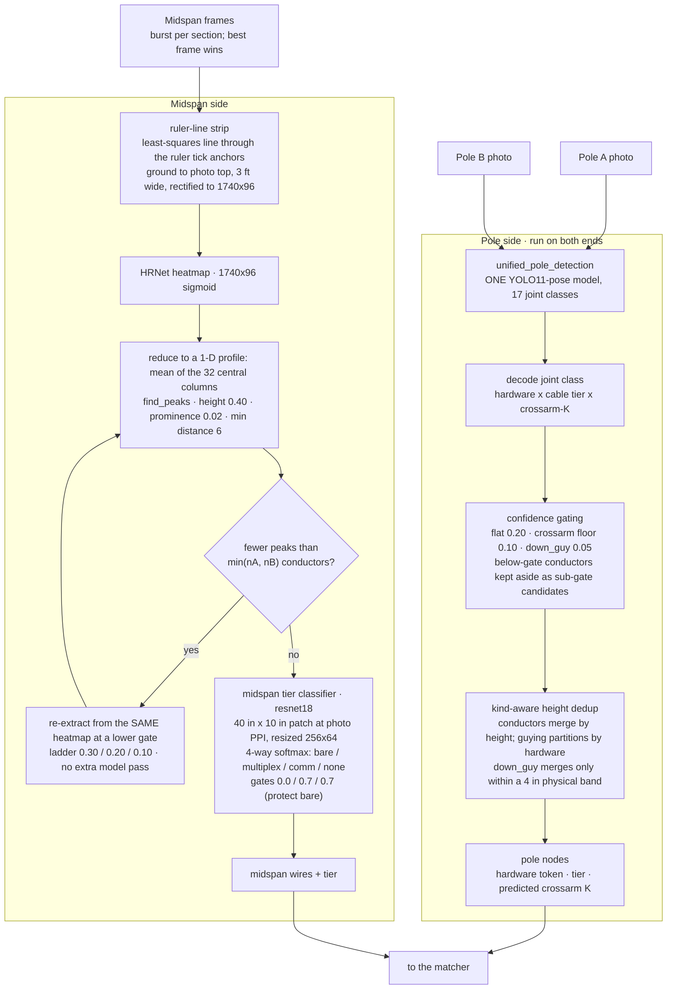
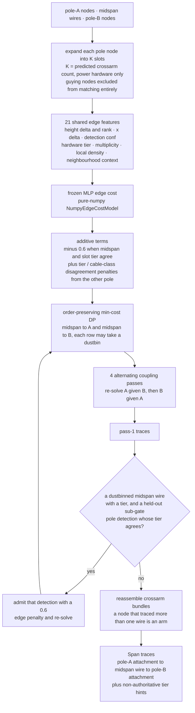
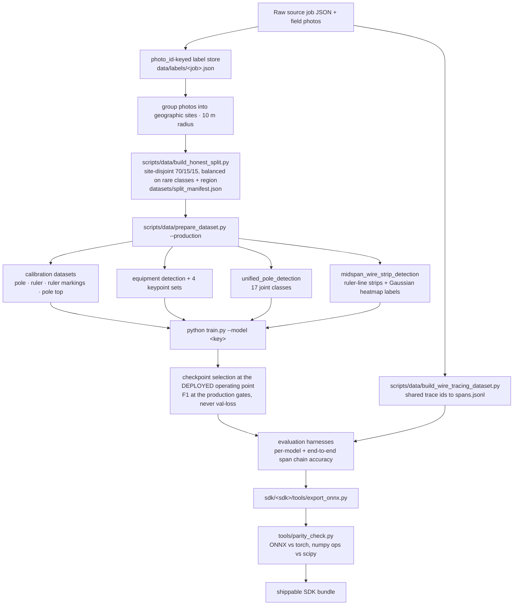
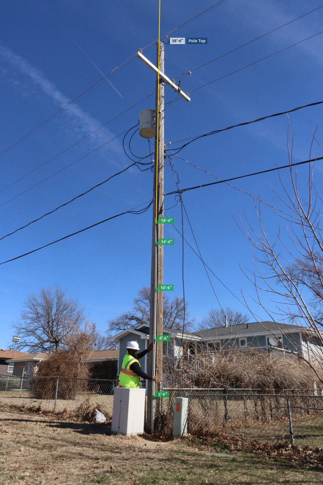
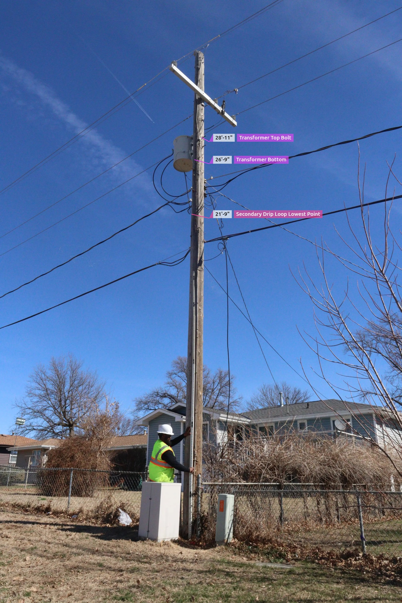

# Pole Annotation Pipeline

Computer-vision pipelines that turn utility-pole field photos into structured
annotation data: **height calibration**, **equipment annotation**, and
**wire tracing** across a span. Training runs on PyTorch; inference ships as
three pure-`numpy` + ONNX Runtime SDKs (no torch, no scipy) suitable for
CPU-only desktop deployment.

> **Weights and data are proprietary** and are not part of this repository.
> The training corpus (~24k labeled field photos across four US regions) and
> the trained checkpoints belong to the client engagement that produced them.
> Everything needed to train on your own data — dataset preparation, trainers,
> evaluation harnesses, and the full inference/SDK source — is here.
>
> **[Live demo →](https://pole-annotation-app-98267233596.us-central1.run.app/demo)**
> (weights load server-side; upload your own photos or use the bundled
> anonymized samples — first request after idle takes ~30 s to warm up)



## Contents

- [System overview](#system-overview)
- [1 · Calibration — pixel → feet](#1--calibration--pixel--feet)
- [2 · Equipment annotation](#2--equipment-annotation)
- [3 · Wire tracing — which attachment connects to which wire](#3--wire-tracing--which-attachment-connects-to-which-wire)
- [Training and data flow](#training-and-data-flow)
- [Honest evaluation methodology](#honest-evaluation-methodology)
- [Repository layout](#repository-layout) · [Quickstart](#quickstart)
- [Lessons that shaped the design](#lessons-that-shaped-the-design)

## System overview

Every downstream measurement is reported in feet and inches, so **calibration
runs first on every photo** and its per-photo pixel→height model is what the
other two stacks consume. Models are shared rather than duplicated: one pole
detector and one upper-70 % crop geometry serve both the equipment stack and the
pole side of the tracer, and the ruler tick anchors define both the height model
and the midspan strip's axis.


```mermaid
flowchart LR
    PP["Pole photo"]
    MP["Midspan photo"]

    subgraph CAL["1 · Calibration"]
        direction TB
        C1["pole · ruler · ruler ticks · pole top"]
        C2["projective pixel to height model"]
        C1 --> C2
    end

    subgraph EQ["2 · Equipment annotation"]
        direction TB
        E1["equipment detection"]
        E2["per-class keypoint heads"]
        E1 --> E2
    end

    subgraph WT["3 · Wire tracing"]
        direction TB
        W1["unified pole model + midspan strip"]
        W2["learned edge-cost matcher"]
        W1 --> W2
    end

    PP --> CAL
    MP --> CAL
    CAL --> EQ
    CAL --> WT
    EQ --> OUT["Structured annotation output<br/>attachments · equipment · span traces<br/>all at calibrated heights"]
    WT --> OUT
```

Each stack is independently runnable and independently packaged as an SDK. A
later stage never invents a detection to satisfy an earlier stage's
expectation — see [Lessons](#lessons-that-shaped-the-design).

## 1 · Calibration — pixel → feet

A surveyor's height ruler is staged in the frame. The pipeline finds it, reads
its tick keypoints, and fits a per-photo model that converts any pixel row into
a height. Pole detection and ruler detection are independent full-image passes,
so a midspan photo (no pole) still calibrates.


```mermaid
flowchart TD
    IMG["Photo · pole or midspan"]

    IMG --> POLE["pole_detection<br/>YOLO11 · full image"]
    IMG --> RUL["ruler_detection<br/>YOLO11 · full image"]

    RUL --> RC["ruler bbox crop"]
    RC --> TICK["ruler_marking_detection<br/>HRNet heatmap · 1440x96 input<br/>5 keypoints at 2.5 / 6.5 / 10.5 / 14.5 / 16.5 ft"]

    POLE --> PC["upper 10 percent of the pole bbox"]
    PC --> PT["pole_top_detection<br/>HRNet heatmap · 256x192 input"]

    TICK --> FIT["projective fit over the tick anchors<br/>inches = (a + b·x) / (1 + c·x)<br/>x = percentY / 100"]
    PT --> OUT
    FIT --> OUT["Per-photo pixel to height model<br/>+ pole-top height"]
```

**Why projective, not a single pixels-per-inch scalar.** A PPI scalar assumes
percentY→height is a straight line, but the ruler is a camera projection, so the
true curve is rational. Fitting `inches = (a + b·x)/(1 + c·x)` over the five tick
anchors is robust to camera tilt and standoff distance and validates to ~0.5 in
against the survey software's own output. This fit is the single source of truth
(`src/ruler_height_model.py`, entry point `src/height_calculations.py`) — the
tracer, the keypoint PCK metrics, and the demo overlay all call it, so a height
means the same thing everywhere. Heights are never stored in the label store;
they are always recomputed from anchors. The fit degrades gracefully: three or
more distinct anchors give the projective model, two fall back to a line, none
falls back to a PPI scalar.

Models: **2 × YOLO11** detectors (`pole_detection`, `ruler_detection`, both on
the full image) + **2 × HRNet** heatmap keypoint models
(`ruler_marking_detection`, `pole_top_detection`, each on a crop). An optional
vertical-shift TTA (`use_tta=True`) averages the two HRNet stages over ±2 px
shifts at ~2–3× the cost.

## 2 · Equipment annotation

Pole-mounted equipment is detected inside the shared pole crop, then a per-class
keypoint head localizes the *attachment point* — the thing that actually gets
recorded in the field survey, and what the calibration model turns into a height.


```mermaid
flowchart TD
    IMG["Pole photo"] --> POLE["pole_detection<br/>YOLO11 · shared with calibration"]
    POLE --> CROP["upper-70 percent 2:5 crop of the pole bbox"]
    CROP --> EQ["equipment_detection<br/>YOLO11 · 4 classes<br/>per-class conf gate + min-area gate"]

    EQ --> B1["transformer"]
    EQ --> B2["riser"]
    EQ --> B3["street_light"]
    EQ --> B4["secondary_drip_loop"]

    B1 --> KP["per-class HRNet keypoint head<br/>run on the equipment bbox crop<br/>at full resolution"]
    B2 --> KP
    B3 --> KP
    B4 --> KP

    KP --> MAP["crop coords to full-image coords"]
    MAP --> H["attachment points in pixels<br/>to feet via the calibration fit"]
```

| class | keypoint head input | keypoints |
|---|---|---|
| `riser` | 384×144 | `top` |
| `transformer` | 384×288 | `top_bolt`, `bottom` |
| `street_light` | 512×384 | `upper_bracket`, `lower_bracket`, `drip_loop` |
| `secondary_drip_loop` | 512×384 | `lowest_point` |

**The crop is the design decision.** Upper 70 % of the pole bbox at a 2:5 aspect
ratio trades field of view for resolution: equipment lives in the upper pole, and
at native resolution a street-light bracket is a handful of pixels in the full
frame. Keypoint heads then run on the *equipment bbox* at full resolution rather
than on the downscaled crop, which is where the localization accuracy comes from.
Each class has its own head (4 sets) because the keypoint semantics differ per
class; detection confidence gates are tuned per class, not globally, and a
minimum-area gate (0.1 % of the crop) drops sub-pixel-scale false positives.

The SDK returns **pixel coordinates**; converting an attachment point to a
height is a separate call into the calibration fit, so the equipment stack can
run on photos with no ruler staged.

## 3 · Wire tracing — which attachment connects to which wire

The hard problem. Given a **pole A / midspan / pole B** photo group — the midspan
may be several sections, each captured as a burst of frames — reconstruct which
attachment on pole A carries which wire across the span to which attachment on
pole B. It runs in two phases: detection on each photo, then a global matching
pass over the whole span.

### 3a · Detection


```mermaid
flowchart TD
    PA["Pole A photo"] --> UNI
    PB["Pole B photo"] --> UNI
    MS["Midspan frames<br/>burst per section; best frame wins"] --> STRIP

    subgraph POLESIDE["Pole side · run on both ends"]
        direction TB
        UNI["unified_pole_detection<br/>ONE YOLO11-pose model, 17 joint classes"]
        DEC["decode joint class<br/>hardware x cable tier x crossarm-K"]
        GATE["confidence gating<br/>flat 0.20 · crossarm floor 0.10 · down_guy 0.05<br/>below-gate conductors kept aside as sub-gate candidates"]
        DED["kind-aware height dedup<br/>conductors merge by height; guying partitions by hardware<br/>down_guy merges only within a 4 in physical band"]
        NODES["pole nodes<br/>hardware token · tier · predicted crossarm K"]
        UNI --> DEC --> GATE --> DED --> NODES
    end

    subgraph MIDSIDE["Midspan side"]
        direction TB
        STRIP["ruler-line strip<br/>least-squares line through the ruler tick anchors<br/>ground to photo top, 3 ft wide, rectified to 1740x96"]
        HM["HRNet heatmap · 1740x96 sigmoid"]
        PK["reduce to a 1-D profile: mean of the 32 central columns<br/>find_peaks · height 0.40 · prominence 0.02 · min distance 6"]
        AD{"fewer peaks than<br/>min(nA, nB) conductors?"}
        RELAX["re-extract from the SAME heatmap at a lower gate<br/>ladder 0.30 / 0.20 / 0.10 · no extra model pass"]
        TIER["midspan tier classifier · resnet18<br/>40 in x 10 in patch at photo PPI, resized 256x64<br/>4-way softmax: bare / multiplex / comm / none<br/>gates 0.0 / 0.7 / 0.7 (protect bare)"]
        MW["midspan wires + tier"]
        STRIP --> HM --> PK --> AD
        AD -- "yes" --> RELAX --> PK
        AD -- "no" --> TIER --> MW
    end

    NODES --> MATCH["to the matcher"]
    MW --> MATCH
```

- **One joint-class pole model.** Rather than a hardware detector plus a
  cable-type classifier, a single YOLO11-pose model predicts 17 *joint* classes
  (`pin / post / davit / deadend / arm2 / arm3 / arm4plus / primary / secondary /
  open_secondary / neutral / catv / telco / fiber / guy / down_guy / unspecified`)
  = hardware × cable tier × crossarm count. One pass gives the per-pole
  attachment inventory *and* the tracer's nodes *and* the class signal the
  matcher couples on.
- **A crossarm is one keypoint carrying K wires.** The `arm2/arm3/arm4plus`
  classes are how K is predicted (K accuracy 0.816); the wires only physically
  separate at midspan. Multiplicity is a model prediction, never an inflation
  invented downstream, and it is restricted to power hardware — communication
  and secondary hardware are capped at one wire.
- **Dedup is physical and kind-aware.** Conductors merge by height alone
  (class-blind — merging only same-class detections was measurably worse), while
  guying nodes partition by hardware so a guy never absorbs a conductor.
  Down-guys merge only inside a 4-inch *physical* band derived from each
  detection's own box scale, which preserves both the ~1 ft stacked racks and the
  genuine same-height anchor pairs that a percentage band would collapse.
- **The midspan strip follows the ruler line, not the image column.** Field
  annotators mark wire crossings *on* the ruler tick line, so the strip axis is
  the least-squares line through the calibration tick anchors, rectified to a
  constant 3 ft width using the local projective scale. That change alone was
  worth +3.7 pp end-to-end over a plain vertical column crop.
- **Peak extraction is count-guided.** Nearly every wire that leaves pole A
  reaches pole B, so the strip should find at least `min(nA, nB)` conductors. If
  it finds fewer, the extractor relaxes its gate for that span only and lets the
  matcher's dustbin absorb any false extra — a missed midspan wire is
  unrecoverable, a spurious one is cheap.
- **The tier classifier includes a veto class.** Four-way softmax, not three:
  the `none` class absorbs false peaks, which is what makes the tier signal safe
  to act on at all. Gates are asymmetric — a `bare` prediction always sticks,
  while `multiplex` and `comm` need p ≥ 0.7, because a wrong non-bare label
  costs more than a missing one. The stage is optional: no tick calibration on
  the frame, or no tier model present, and every crossing simply carries no
  tier, the matcher bonus becomes a no-op, and sub-gate admission never fires.

### 3b · Matching


```mermaid
flowchart TD
    IN["pole-A nodes · midspan wires · pole-B nodes"]
    SLOT["expand each pole node into K slots<br/>K = predicted crossarm count, power hardware only<br/>guying nodes excluded from matching entirely"]
    FEAT["21 shared edge features<br/>height delta and rank · x delta · detection conf<br/>hardware tier · multiplicity · local density · neighbourhood context"]
    COST["frozen MLP edge cost<br/>pure-numpy NumpyEdgeCostModel"]
    ADD["additive terms<br/>minus 0.6 when midspan and slot tier agree<br/>plus tier / cable-class disagreement penalties from the other pole"]
    ASSIGN["order-preserving min-cost DP<br/>midspan to A and midspan to B, each row may take a dustbin"]
    ICM["4 alternating coupling passes<br/>re-solve A given B, then B given A"]
    P1["pass-1 traces"]
    SG{"a dustbinned midspan wire<br/>with a tier, and a held-out sub-gate<br/>pole detection whose tier agrees?"}
    ADMIT["admit that detection with a 0.6<br/>edge penalty and re-solve"]
    BUN["reassemble crossarm bundles<br/>a node that traced more than one wire is an arm"]
    OUT["Span traces<br/>pole-A attachment to midspan wire to pole-B attachment<br/>plus non-authoritative tier hints"]

    IN --> SLOT --> FEAT --> COST --> ADD --> ASSIGN --> ICM --> P1 --> SG
    SG -- "yes" --> ADMIT --> ASSIGN
    SG -- "no" --> BUN --> OUT
```

- **Non-crossing is the single biggest structural prior.** Wires in a span do
  not cross each other, so the assignment is an order-preserving minimum-cost
  dynamic program over midspans and slots sorted by height — not a free
  Hungarian assignment (the pure-numpy Hungarian is only used if the monotonic
  constraint is switched off). Worth ~7 pp at the ground-truth ceiling.
- **The two ends are coupled softly, not jointly solved.** Each side is matched
  against the midspan separately, then re-solved four times, each pass seeing
  the other side's current answer through three penalty terms: dustbinning a
  midspan wire the other pole *did* match is penalized, as is matching a slot
  whose hardware tier or cable class contradicts the other end. Pressure toward
  "match both ends or neither" — but as cost, not as a hard constraint, so a
  genuinely one-ended wire can still pay the price and win.
- **A crossarm is split for matching and reassembled after.** Each node expands
  into K independent slots which are matched individually; a node that ends up
  carrying more than one wire is then labelled a crossarm. Matching the bundle
  as a unit was tried and is worse — the wires separate at midspan, so they
  genuinely are K separate correspondence problems.
- **Effectively height-only, by construction.** Because the midspan strip is cut
  along the ruler line, every crossing is projected onto that line and shares
  essentially the same x — horizontal position carries almost no information, and
  the hand-tuned fallback cost zeroes it outright. Matching is a vertical
  ordering problem.
- **The learned cost buys noise robustness, not a better class signal.** A
  frozen 21-feature MLP replaces the hand-tuned linear cost. The gain comes from
  the *nonlinear × context interaction* — a linear model on the same features
  recovers only half of it, and context features help only the nonlinear model.
  The model is frozen to pure numpy so the SDK needs no sklearn or torch.
- **Sub-gate admission is corroboration-driven.** Below-threshold pole
  detections are held out of pass 1 and only admitted when an unmatched midspan
  wire of an agreeing tier vouches for them — they must beat the dustbin on
  corroboration, not on their own confidence.
- **Multi-section spans** (pole A → M1 → … → Mk → pole B) detect each section
  independently and thread the wire through all of them, with explicit inferred
  pass-through waypoints where a section has no usable photo.

Cable type is **not** inferred as an authoritative output — the tracer emits a
non-authoritative `tier_hint` and the reviewer assigns the wire type. The tracer
is deployed as an assisted-review first pass, not an auto-annotator.

## Training and data flow


```mermaid
flowchart TD
    RAW["Raw source job JSON + field photos"]
    LS["photo_id-keyed label store<br/>data/labels/&lt;job&gt;.json"]
    SITES["group photos into geographic sites · 10 m radius"]
    SPLIT["scripts/data/build_honest_split.py<br/>site-disjoint 70/15/15, balanced on rare classes + region<br/>datasets/split_manifest.json"]
    PREP["scripts/data/prepare_dataset.py --production"]

    RAW --> LS --> SITES --> SPLIT --> PREP

    PREP --> D1["calibration datasets<br/>pole · ruler · ruler markings · pole top"]
    PREP --> D2["equipment detection + 4 keypoint sets"]
    PREP --> D3["unified_pole_detection<br/>17 joint classes"]
    PREP --> D4["midspan_wire_strip_detection<br/>ruler-line strips + Gaussian heatmap labels"]

    RAW --> GTX["scripts/data/build_wire_tracing_dataset.py<br/>shared trace ids to spans.jsonl"]

    D1 --> TRAIN["python train.py --model &lt;key&gt;"]
    D2 --> TRAIN
    D3 --> TRAIN
    D4 --> TRAIN

    TRAIN --> SEL["checkpoint selection at the DEPLOYED operating point<br/>F1 at the production gates, never val-loss"]
    SEL --> EVAL["evaluation harnesses<br/>per-model + end-to-end span chain accuracy"]
    GTX --> EVAL

    EVAL --> EXP["sdk/&lt;sdk&gt;/tools/export_onnx.py"]
    EXP --> PAR["tools/parity_check.py<br/>ONNX vs torch, numpy ops vs scipy"]
    PAR --> SDKB["shippable SDK bundle"]
```

`train.py` is the single entry point for all eleven trainable models:
`pole_detection`, `ruler_detection`, `ruler_marking_detection`,
`pole_top_detection`, `equipment_detection`, `unified_pole_detection`,
`midspan_wire_strip_detection`, and the four equipment keypoint models
(`riser_` / `transformer_` / `street_light_` / `secondary_drip_loop_keypoint_detection`).

See [`docs/DATA_FORMAT.md`](docs/DATA_FORMAT.md) for the label schema you need to
produce to train on your own corpus.

## Honest evaluation methodology

All quoted metrics come from a **site-disjoint split**: photos are grouped
into geographic sites (10 m radius) and every site lives entirely in train,
val, OR test — because utilities re-photograph the same poles across job
revisions, a naive photo-level split leaks and inflates scores by 5–10 pp.
Checkpoint selection uses the deployed operating point (F1 at the production
confidence gates), never val-loss.

| Metric (held-out, site-disjoint) | Score |
|---|---|
| Per-pole annotation micro-F1 (17 joint classes) | **0.717** |
| Crossarm-count accuracy | **0.816** |
| End-to-end span-trace chain accuracy* | **0.56** |
| Equipment detection F1 | **0.84** |
| Equipment keypoint PCK@2 in | 0.43–0.62 per class |
| Calibration height projection vs survey SW | ~0.5 in |

\* Chain accuracy = a midspan wire is traced to the correct attachment on
*both* poles; scored against annotation ground truth that is itself ~90 %
complete, so this is a floor.

## Repository layout

```
src/                    training-time pipelines, matcher, eval logic (torch)
train.py                single entry point for all model trainings
scripts/data/           dataset preparation (site-disjoint split, label store)
scripts/train/          trainers + variant/experiment launchers
scripts/eval/           evaluation harnesses (per-model + end-to-end)
scripts/tracer/         run the full wire tracer over span groups
sdk/                    pure-numpy ONNX inference SDKs (no torch/scipy)
  calibration_sdk/v2/       pole + ruler + ticks + pole top
  equipment_annotation_sdk/v1/  equipment YOLO + HRNet keypoints
  wire_tracer_sdk/v2.9.1/   unified pole + strip + tier + learned matcher
deploy/                 FastAPI demo webapp
```

The SDKs are versioned directories and share weights rather than duplicating
them: `pole_detection.onnx` and `ruler_detection.onnx` have a single owner
(`calibration_sdk/v2`) and the other two SDKs reference them, so keep the SDK
folders as siblings or pass explicit weight paths.

## Quickstart

### Inference SDKs (ONNX, CPU-only)

```
pip install numpy onnxruntime opencv-python-headless Pillow
```

```python
# packages live one level inside the versioned SDK dir, e.g.
#   sdk/calibration_sdk/v2/calibration/
from calibration import CalibrationPipeline
from equipment_annotation import EquipmentAnnotationPipeline
from wire_tracer import WireTracerPipeline

calib = CalibrationPipeline()
result = calib.run(rgb_image)          # pole bbox, ruler ticks, pole top

tracer = WireTracerPipeline()
trace = tracer.run(pole_a_rgb, [midspan_rgb], pole_b_rgb,
                   midspan_ticks=ticks)   # (ft, %x, %y) calibration ticks
```

Pass `midspan_ticks` whenever the calling application already has calibration
ticks for the midspan frame — that is the production path (ruler-line strip
geometry plus the tier stage). Without them the tracer still runs, but falls
back to the legacy ruler-detection column crop and loses the tier signal.

Each SDK expects its `weights/` directory next to the package (see each SDK's
`README.md` / `INTEGRATION.md`). Weights are exported from trained checkpoints
with the SDK's `tools/export_onnx.py`; parity against the torch pipeline is
checked by `tools/parity_check.py` (detection tolerance ~1e-4, matcher
byte-exact).

Notable engineering: the wire-tracer SDK reimplements
`scipy.optimize.linear_sum_assignment` and `scipy.signal.find_peaks` in pure
numpy (`numpy_ops.py`, verified 200/200 random cases each against scipy) so
the destination machine needs no scipy/torch.

### Training on your own data

1. Build the label store and site-disjoint split
   (`scripts/data/build_honest_split.py`) — see
   [`docs/DATA_FORMAT.md`](docs/DATA_FORMAT.md) for the expected label schema.
2. `python scripts/data/prepare_dataset.py --production` builds every stack's
   dataset from the split manifest.
3. `python train.py --model unified_pole_detection` (or any of the other ten
   model keys listed above).
4. Evaluate: `scripts/eval/eval_unified_pole.py`,
   `eval_midspan_strip_f1.py`, `eval_wire_tracing_e2e.py`.
5. Export ONNX: `python sdk/<sdk>/v*/tools/export_onnx.py`, then
   `tools/parity_check.py`.

### Demo webapp

```
pip install -r requirements-deploy.txt
python -m uvicorn deploy.main:app --port 8000
# open http://localhost:8000/demo
```

Per-photo annotation views (calibration / equipment / attachments) and a
span-trace view (pole A | midspans | pole B with traced wires), with
ground-truth overlay left of the ruler line when a local label store exists.

## Sample outputs

| | |
|---|---|
|  |  |
| Ruler ticks + pole top + height model | Equipment + keypoints at calibrated heights |

## Lessons that shaped the design

- **Site-disjoint or it didn't happen.** Photo-level random splits leaked
  5–10 pp on every model; all metrics here are from site-disjoint splits.
- **Select checkpoints at the deployed operating point.** Val-loss checkpoint
  selection cost 2.1 pp end-to-end on the strip detector; the trainer now
  tracks F1 at the production peak-extraction op-point.
- **Stage independence.** Later stages never invent detections to satisfy
  earlier-stage expectations — crossarm wire multiplicity is a model
  prediction, not a downstream inflation.
- **Match the geometry the annotator used.** Wire crossings are marked on the
  ruler tick line, so detecting along that line rather than an image column was
  worth more than any architecture change tried.
- **Re-tune the matcher after every detector change.** Matcher weights and
  detector quality co-evolve; a lever that helped one detector generation was
  repeatedly neutral or negative on the next.
- **The matcher is information-bound.** Same-tier wires at similar heights
  carry no distinguishing signal in single photos; the residual error budget
  points at capture-time changes, not model capacity.

## License

MIT (code). Model weights and training data are not distributed.
